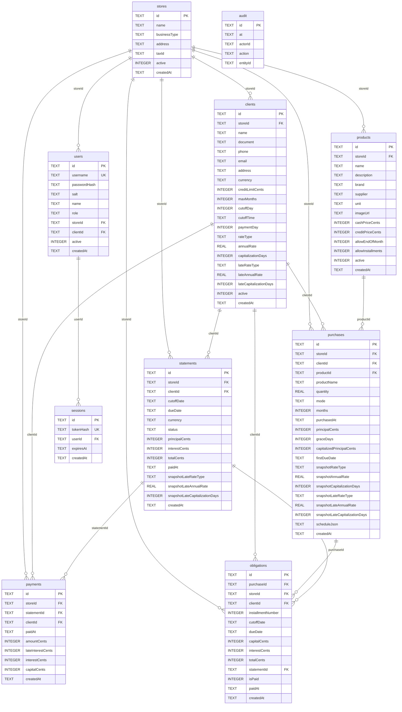

# Informe Técnico y Académico: Sistema de Crédito Vecinal "Crédito Barrio"
**Curso:** Finanzas e Ingeniería Económica (SI642 2026-20)  
**Proyecto:** Crédito Barrio — Prototipo Académico Validado Localmente  
**Fecha de Emisión:** Setiembre 2026  
**Estado del Documento:** Versión Académica Revisada  

---

## 1. Introducción y Alcance del Proyecto

### 1.1 Contexto y Motivación
En el comercio minorista tradicional del Perú (bodegas de barrio, boticas independientes y puestos de mercado), la práctica informal del crédito directo o "fiado" constituye un mecanismo frecuente de financiamiento a corto plazo para las familias. No obstante, en su forma consuetudinaria adolece de problemas estructurales:
- Registro informal en libretas susceptibles a extravío, manipulación o deterioro.
- Inexistencia de un cálculo transparente y estructurado de intereses compensatorios y moratorios.
- Falta de predictibilidad financiera tanto para el comerciante como para el vecino consumidor.

El proyecto **Crédito Barrio** fue concebido como un **prototipo académico de ingeniería económica** para modelar digitalmente una cuenta corriente crediticia vecinal, aplicando formulaciones matemáticas financieras (equivalencia de tasas, amortización francesa, convención 30E/360 y liquidación de mora) en un entorno local y autónomo.

> [!WARNING]
> **Naturaleza del Sistema y Descargo de Responsabilidad:**  
> Este desarrollo es un **prototipo académico validado localmente** para el curso **SI642**, no un software bancario comercial ni un sistema en producción certificado. Las formulaciones se implementan con fines didácticos. El prototipo no garantiza infalibilidad matemática ni ausencia de desbordamiento en entornos de alta concurrencia, y opera bajo supuestos simplificados de laboratorio.

### 1.2 Alcance Técnico del Prototipo
- **Arquitectura Local Monolítica:** Aplicación web con Frontend en Angular 21 (`src/app/current-account/`) y Backend en Node.js >= 24.15 empleando la biblioteca nativa `node:sqlite` (`DatabaseSync`), `node:http` y `node:crypto`.
- **Motor Financiero Local:** Soporte para tasas efectivas (TEA) y nominales (TNA con periodicidad de capitalización), convención de conteo de días 30E/360, capitalización de gracia inicial, cuotas mensuales francesas y recargo moratorio.
- **Base de Datos Local:** Archivo SQLite en `local-server/data/credit.sqlite`, con partición lógica multi-tienda mediante `storeId`.

---

## 2. Marco Teórico y Marco Legal

### 2.1 Marco Teórico Financiero

#### 2.1.1 Equivalencia de Tasas
El valor del dinero en el tiempo se formaliza mediante tasas de interés equivalentes:
- **Tasa Efectiva Anual (TEA):** Expresa el costo o rendimiento efectivo en un año base de 360 días sin requerir submúltiplos de capitalización.
- **Tasa Nominal Anual (TNA):** Tasa contractual pactada que requiere una periodicidad de capitalización ($k$ días o $m = 360/k$ periodos anuales) para determinar la tasa periódica efectiva.

#### 2.1.2 Convención de Conteo de Días: 30E/360
Para evitar irregularidades en el cálculo mensual derivadas de los diferentes días calendario de cada mes, se adopta la convención comercial 30E/360 (estándar europeo):
$$d = 360 \times (Y_2 - Y_1) + 30 \times (M_2 - M_1) + \min(D_2, 30) - \min(D_1, 30)$$

#### 2.1.3 Sistema de Amortización Francés con Gracia
En créditos a plazos, los días transcurridos entre la fecha de compra y la fecha de referencia del ciclo se consideran un periodo de gracia inicial. Los intereses devengados en dicho periodo se capitalizan al principal inicial ($P$). A partir de este principal capitalizado, se genera un cronograma de $n$ cuotas mensuales constantes ($A$), absorbiendo en la última amortización las discrepancias fraccionarias de redondeo a centavos.

### 2.2 Marco Legal y Regulatorio Peruano (Fuentes Oficiales y Ámbito de Aplicación)

> [!IMPORTANT]
> **Precisiones Regulatorias y Fuente de la Jerarquía de Pagos:**  
> Las normas de la Superintendencia de Banca, Seguros y AFP (SBS) regulan a las empresas del sistema financiero debidamente autorizadas (bancos, cajas municipales, financieras); **no son automáticamente aplicables por imperio de la ley a los comerciantes minoristas informales o bodegas de barrio**.  
> En este proyecto académico, la jerarquía de imputación de pagos (**Mora $\rightarrow$ Interés Compensatorio $\rightarrow$ Capital**) y las buenas prácticas de transparencia informativa se adoptan por **mandato expreso de la rúbrica y especificación académica del curso SI642**, tomando las directrices públicas peruanas como un marco conceptual de referencia, cuya aplicabilidad jurídica directa en el sector no regulado se encuentra pendiente de validación legal.

**Fuentes Oficiales de Consulta:**
- **Superintendencia de Banca, Seguros y AFP (SBS):** [Portal Oficial SBS](https://www.sbs.gob.pe) | [Compendio Normativo de Conducta de Mercado](https://www.sbs.gob.pe/normativa-y-estandares/normativa) (Resolución SBS N° 3274-2017: principios de transparencia y entrega de liquidaciones de deuda).
- **Banco Central de Reserva del Perú (BCRP):** [Portal Oficial BCRP](https://www.bcrp.gob.pe) | [Tasas de Interés y Marco Legal](https://www.bcrp.gob.pe/tasas-de-interes/tasas-legales.html) (Ley N° 31143 sobre tasas de interés máximas compensatorias y moratorias).
- **Instituto Nacional de Defensa de la Competencia y de la Protección de la Propiedad Intelectual (INDECOPI):** [Portal Oficial INDECOPI](https://www.indecopi.gob.pe) (Código de Protección y Defensa del Consumidor, Ley N° 29571).

---

## 3. Diccionarios de Datos: Esquema Real del Backend

### 3.1 Diccionario de Datos de Entrada (Inputs de la API)

| Entidad / Endpoint | Campo | Tipo Primitivo | Formato / Valores | Restricciones de Negocio |
| :--- | :--- | :--- | :--- | :--- |
| `POST /api/stores` | `name` | `string` | Texto no vacío | Denominación de la tienda. |
| `POST /api/stores` | `businessType`| `string` | Texto libre | Giro (ej. `BODEGA`, `FARMACIA`, `SALON`). |
| `POST /api/stores` | `address` | `string` | Texto no vacío | Dirección física local. |
| `POST /api/stores` | `taxId` | `string` | Alfanumérico | RUC o DNI del comercio. |
| `POST /api/stores` | `adminUsername`| `string` | Alfanumérico | Usuario único del administrador del comercio. |
| `POST /api/stores` | `adminPassword`| `string` | $\ge 8$ caracteres | Clave del comercio (almacenada como scrypt). |
| `POST /api/clients` | `name` | `string` | Texto no vacío | Nombres del cliente. |
| `POST /api/clients` | `document` | `string` | DNI / CE | Documento de identidad único por tienda. |
| `POST /api/clients` | `currency` | `string` | `PEN` \| `USD` | Moneda de cuenta del cliente (sin conversión FX). |
| `POST /api/clients` | `creditLimit` | `number` | Decimal $\ge 0.00$ | Límite crediticio. No reducible bajo exposición vigente. |
| `POST /api/clients` | `maxMonths` | `integer` | Rango $[1, 60]$ | Plazo máximo permitido para cuotas. |
| `POST /api/clients` | `cutoffDay` | `integer` | Rango $[1, 28]$ | Día mensual de corte (evita desbordes de febrero). |
| `POST /api/clients` | `cutoffTime` | `string` | `HH:mm` (24h) | Hora límite de cierre (hora local de Lima). |
| `POST /api/clients` | `paymentDay` | `integer` | Rango $[1, 28]$ | Día límite de pago sin mora. |
| `POST /api/clients` | `rateType` | `string` | `EFFECTIVE` \| `NOMINAL` | Tipo de tasa compensatoria. |
| `POST /api/clients` | `annualRate` | `number` | Porcentaje $\ge 0.00$ | Tasa anual pactada (ej. `36.00`). |
| `POST /api/clients` | `capitalizationDays`| `integer` | `1, 15, 30, 60, 90, 180, 360` | Frecuencia si la tasa es `NOMINAL`. |
| `POST /api/clients` | `lateRateType` | `string` | `EFFECTIVE` \| `NOMINAL` | Tipo de tasa moratoria pactada. |
| `POST /api/clients` | `lateAnnualRate`| `number` | Porcentaje $\ge 0.00$ | Tasa anual de mora pactada. |
| `POST /api/clients` | `lateCapitalizationDays`| `integer` | `1, 15, 30, 60, 90, 180, 360` | Frecuencia de capitalización de mora si nominal. |
| `POST /api/products` | `cashPrice` | `number` | Decimal $\ge 0.01$ | Precio contado en la moneda del cliente/tienda. |
| `POST /api/products` | `creditPrice` | `number` | Decimal $\ge 0.01$ | Precio financiado base. |
| `POST /api/purchases`| `quantity` | `number` | Positivo $\ge 1$ | Cantidad adquirida. |
| `POST /api/purchases`| `mode` | `string` | `END_OF_MONTH` \| `INSTALLMENTS` | Modalidad de crédito elegida. |
| `POST /api/purchases`| `months` | `integer` | $[1, \text{maxMonths}]$ | Meses de plazo (1 si fin de mes). |
| `POST /api/purchases`| `purchasedAt` | `string` | `YYYY-MM-DDTHH:mm` | Fecha y hora local de Lima. |
| `POST /api/statements/:id/pay` | `paidAt` | `string` | `YYYY-MM-DD` | Fecha de pago ($\ge \text{cutoffDate}$). |
| `POST /api/statements/:id/pay` | `amount` | `number` | Decimal exacto | Debe igualar con exactitud a `payableTotal`. |

### 3.2 Almacenamiento Interno en Base de Datos (SQLite)

La base de datos almacena los saldos y deudas en **centavos enteros** para mitigar errores acumulativos de punto flotante:
- `creditLimitCents`, `cashPriceCents`, `creditPriceCents`, `principalCents`, `capitalizedPrincipalCents`, `capitalCents`, `interestCents`, `totalCents`, `amountCents`, `lateInterestCents`.
- Las tasas (`annualRate`, `lateAnnualRate`) y factores se guardan como reales (`REAL` en SQLite).

### 3.3 Diccionario de Salida (Respuestas API)

| Objeto de Salida | Propiedad | Tipo | Ejemplo de Ejecución | Descripción |
| :--- | :--- | :--- | :--- | :--- |
| `PurchasePreview` | `principal` | `number` | `600.00` | Monto bruto de compra (`creditPrice * quantity`). |
| `PurchasePreview` | `graceDays` | `integer` | `11` | Días entre compra y fecha de referencia del ciclo. |
| `PurchasePreview` | `capitalizedPrincipal` | `number` | `605.66` | Capital con gracia capitalizada (redondeado a 2 dec.). |
| `PurchasePreview` | `schedule` | `array` | Ver filas en Sección 5.1 | Fila 1: `capital: 196.74, interest: 15.72, total: 212.46`. |
| `StatementDetail` | `principal` | `number` | `200.00` | Capital agregado del estado de cuenta. |
| `StatementDetail` | `interest` | `number` | `1.32` | Interés compensatorio regular facturado. |
| `StatementDetail` | `lateInterest` | `number` | `1.99` | Recargo por mora según días transcurridos. |
| `StatementDetail` | `payableTotal` | `number` | `203.31` | Total a cobrar (`principal + interest + lateInterest`). |
| `Payment` | `allocation` | `object` | `{lateInterest: 1.99, interest: 1.32, capital: 200.00}` | Imputación conforme a la rúbrica del curso. |

---

## 4. Fórmulas Matemáticas y Reglas de Negocio

### 4.1 Conteo de Días 30E/360
Para dos fechas $F_1 = (Y_1, M_1, D_1)$ y $F_2 = (Y_2, M_2, D_2)$:
$$D'_1 = \min(D_1, 30), \quad D'_2 = \min(D_2, 30)$$
$$d = 360 \times (Y_2 - Y_1) + 30 \times (M_2 - M_1) + (D'_2 - D'_1)$$

### 4.2 Tasas de Interés y Conversiones
- **TEA ($E\%$):** $i_d = (1 + E/100)^{d/360} - 1$
- **TNA ($J\%$, capitalización cada $k$ días):** $i_d = \left(1 + \frac{J/100}{360/k}\right)^{d/k} - 1$
- Tasa mensual estándar de 30 días: $i_{30}$ calculada con $d=30$.

### 4.3 Modalidad Cuotas Francesas con Gracia
1. $d_{gracia} = d_{30E/360}(F_{compra}, F_{ref})$.
2. Capital con gracia: $P = \text{roundMoney}(C \times (1 + i_{diaria})^{d_{gracia}})$.  
   *(Nota: El motor utiliza el valor redondeado de $P$ para la fórmula de la cuota francesa).*
3. Cuota periódica fija:
   $$A = \text{roundMoney}\left(P \times \frac{i_{30}}{1 - (1 + i_{30})^{-n}}\right)$$
4. Cada periodo $t$:
   $$I_t = \text{roundMoney}(\text{Saldo}_{t-1} \times i_{30})$$
   $$\text{Amort}_t = \text{roundMoney}(A - I_t)$$
   $$\text{Saldo}_t = \text{roundMoney}(\text{Saldo}_{t-1} - \text{Amort}_t)$$
   En la última cuota ($t = n$), la amortización absorbe el saldo remanente:
   $$\text{Amort}_n = \text{Saldo}_{n-1}, \quad A_n = \text{Amort}_n + I_n, \quad \text{Saldo}_n = 0.00$$

### 4.4 Liquidación de Mora con Snapshot Histórico
El cálculo del interés moratorio no utiliza la tasa actual mutable del cliente, sino el **snapshot histórico pactado al momento de originar la obligación o el estado de cuenta**:
$$d_{mora} = \max(0, d_{30E/360}(F_{venc}, F_{asOf}))$$
$$I_{mora} = \text{roundMoney}(\text{TotalVencido} \times i_{mora, d_{mora}})$$
Si $F_{asOf} \le F_{venc}$, $d_{mora} = 0$ y $I_{mora} = 0.00$.

---

## 5. Juegos de Datos de Referencia Contrastados con Ejecución en Node

> [!NOTE]
> Los valores numéricos presentados a continuación fueron **contrastados directamente contra la ejecución real del motor en Node.js realizada por el lead**.

### 5.1 Juego de Datos N° 1: Compra en Cuotas Francesas (Ejemplo Obligatorio)
- **Condiciones del Cliente:** TEA $36.00\%$, Corte: día 20 (23:59), Pago: día 26.
- **Compra:** `2026-09-15T11:30`, $C = 600.00$ PEN, Plazo: 3 meses.
- **Valores Ejecutados en Node:**
  - Vencimiento de referencia: `2026-09-26` $\rightarrow$ Días de gracia: $11$.
  - Tasa de gracia de 11 días: $i_{11} = (1.36)^{11/360} - 1 = \mathbf{0.00943964082644277}$.
  - Principal capitalizado: $P = \text{roundMoney}(600.00 \times 1.00943964082644277) = \mathbf{605.66}\text{ PEN}$.
  - Tasa mensual de 30 días: $i_{30} = (1.36)^{30/360} - 1 = \mathbf{0.0259548346585463}$.
  - Cuota base mensual francesa: $A = \mathbf{212.46}\text{ PEN}$.

#### Cronograma Contrastado con la Ejecución del Lead:

| N° Cuota | Vencimiento | Corte Asociado | Saldo Inicial | Cuota Total | Interés | Amortización | Saldo Final |
| :---: | :---: | :---: | :---: | :---: | :---: | :---: | :---: |
| **1** | 2026-10-26 | 2026-10-20 | S/ 605.66 | **S/ 212.46** | S/ 15.72 | S/ 196.74 | S/ 408.92 |
| **2** | 2026-11-26 | 2026-11-20 | S/ 408.92 | **S/ 212.46** | S/ 10.61 | S/ 201.85 | S/ 207.07 |
| **3** | 2026-12-26 | 2026-12-20 | S/ 207.07 | **S/ 212.44\*** | S/ 5.37 | S/ 207.07 | S/ 0.00 |
| **Totales** | — | — | — | **S/ 637.36** | **S/ 31.70** | **S/ 605.66** | — |

*\*Ajuste de centavos en Cuota 3:* $207.07 + 5.37 = 212.44$ PEN.  
*Totales ejecutados:* Capital: S/ 605.66, Interés: S/ 31.70, Total Pagado: S/ 637.36.

---

### 5.2 Juego de Datos N° 2: Pago Único Fin de Mes y Liquidación con Mora
- **Condiciones del Cliente:** TNA $24.00\%$ ($k=30$ días, tasa mensual $2\%$), TNA Mora $36.00\%$ ($k=30$ días, mora mensual $3\%$). Corte: día 20 (18:00), Pago: día 26.
- **Evento 2.A (Antes del corte):** Compra el `2026-09-16T10:00` por S/ 200.00.
  - Vence: `2026-09-26` ($d = 10$ días).
  - Tasa: $(1 + 0.02)^{10/30} - 1 \approx 0.00662271$.
  - Interés: S/ 1.32. Total compra: **S/ 201.32**.
- **Evento 2.B (Después del corte):** Compra el `2026-09-22T14:00` por S/ 150.00.
  - Pasa al ciclo de octubre (corte `2026-10-20`, vence `2026-10-26`, $d = 34$ días).
  - Tasa: $(1 + 0.02)^{34/30} - 1 \approx 0.02269899$.
  - Interés: S/ 3.40. Total compra: **S/ 153.40** (facturación de octubre).
- **Evento 2.C (Cierre setiembre y pago tardío el 2026-10-06):**
  - Estado de cuenta de setiembre: S/ 200.00 capital + S/ 1.32 interés = S/ 201.32 (Vence `2026-09-26`).
  - Días de mora al `2026-10-06`: $d_{mora} = 10$ días (30E/360).
  - Tasa de mora: $(1 + 0.03)^{10/30} - 1 \approx 0.00990163$.
  - Interés moratorio devengado: $\text{roundMoney}(201.32 \times 0.00990163) = \mathbf{S/\ 1.99}$.
  - Total exigible (`payableTotal`): $201.32 + 1.99 = \mathbf{S/\ 203.31}$.
  - **Imputación conforme a la rúbrica del curso:**
    1. Mora: S/ 1.99 (remanente: S/ 0.00).
    2. Interés compensatorio: S/ 1.32 (remanente: S/ 0.00).
    3. Capital: S/ 200.00 (remanente: S/ 0.00).
    Estado final: `PAID`.

---

## 6. Pseudocódigo: Motor Financiero con Snapshots y Agregación

### 6.1 Algoritmo de Cronograma en Cuotas Francesas
```text
ALGORITMO calcularCronogramaCuotas(principal, fechaCompra, cutoffDay, cutoffTime, paymentDay, rateType, annualRate, capDays, meses):
    ciclo = calcularCorteYVencimientoRef(fechaCompra, cutoffDay, cutoffTime, paymentDay)
    diasGracia = calcularDias30E360(extraerFecha(fechaCompra), ciclo.refDueDate)
    
    factorGracia = calcularFactorTasa(rateType, annualRate, capDays, diasGracia)
    capitalCapitalizado = redondearMoneda(principal * factorGracia)
    
    i30 = calcularTasaInteres(rateType, annualRate, capDays, 30)
    SI i30 == 0 ENTONCES
        cuotaFija = redondearMoneda(capitalCapitalizado / meses)
    SINO
        cuotaFija = redondearMoneda((capitalCapitalizado * i30) / (1 - POTENCIA(1 + i30, -meses)))
    FIN SI
    
    saldoRestante = capitalCapitalizado
    cronograma = []
    
    PARA k = 1 HASTA meses HACER:
        fechaVenc = sumarMesesFecha(ciclo.refDueDate, k, paymentDay)
        fechaCorte = obtenerCorteParaVencimiento(fechaVenc, cutoffDay, paymentDay)
        
        interes = redondearMoneda(saldoRestante * i30)
        SI k < meses ENTONCES
            capital = redondearMoneda(cuotaFija - interes)
            SI capital < 0 ENTONCES capital = 0 FIN SI
            saldoRestante = redondearMoneda(saldoRestante - capital)
            total = redondearMoneda(capital + interes)
        SINO
            // Ultima cuota absorbe el saldo exacto para saldo final cero
            capital = saldoRestante
            saldoRestante = 0.00
            total = redondearMoneda(capital + interes)
        FIN SI
        
        cronograma.AGREGAR({
            numero: k,
            dueDate: fechaVenc,
            cutoffDate: fechaCorte,
            capital: capital,
            interest: interes,
            total: total
        })
    FIN PARA
    
    RETORNAR {
        principal: principal,
        graceDays: diasGracia,
        capitalizedPrincipal: capitalCapitalizado,
        firstDueDate: cronograma[0].dueDate,
        schedule: cronograma
    }
FIN ALGORITMO
```

### 6.2 Algoritmo de Liquidación de Mora con Snapshot Histórico
```text
ALGORITMO liquidarMoraEstadoCuenta(estado, asOfDate):
    SI asOfDate < estado.cutoffDate ENTONCES
        ERROR("La fecha de consulta no puede ser anterior a la fecha de corte")
    FIN SI
    
    SI estado.status == 'PAID' ENTONCES
        pago = OBTENER_PAGO_POR_ESTADO(estado.id)
        RETORNAR {
            lateDays: 0,
            lateInterest: pago.lateInterest,
            payableTotal: 0.00
        }
    FIN SI
    
    totalVencido = redondearMoneda(estado.principal + estado.interest)
    SI asOfDate <= estado.dueDate ENTONCES
        RETORNAR {
            lateDays: 0,
            lateInterest: 0.00,
            payableTotal: totalVencido
        }
    FIN SI
    
    diasMora = MAX(0, calcularDias30E360(estado.dueDate, asOfDate))
    SI diasMora == 0 ENTONCES
        RETORNAR { lateDays: 0, lateInterest: 0.00, payableTotal: totalVencido }
    FIN SI
    
    // IMPORTANTE: Utiliza el snapshot histórico guardado en el estado de cuenta
    tasaMora = calcularTasaInteres(
        estado.snapshotLateRateType,
        estado.snapshotLateAnnualRate,
        estado.snapshotLateCapitalizationDays,
        diasMora
    )
    
    moraDevengada = redondearMoneda(totalVencido * tasaMora)
    totalExigible = redondearMoneda(totalVencido + moraDevengada)
    
    RETORNAR {
        lateDays: diasMora,
        lateInterest: moraDevengada,
        payableTotal: totalExigible
    }
FIN ALGORITMO
```

### 6.3 Agregación de Obligaciones con Snapshots Históricos
Al consolidar obligaciones en un estado de cuenta (`generateStatements`), las obligaciones agrupan consumos del mismo ciclo (`clientId`, `cutoffDate`, `dueDate`). En el prototipo actual, el estado de cuenta hereda el snapshot moratorio de las obligaciones asociadas del cliente al momento del cierre. En caso de que se admitan obligaciones individuales con condiciones divergentes, la liquidación debe iterar cada obligación para aplicar su snapshot respectivo o calcular una tasa promedio ponderada por capital adeudado.

---

## 7. Modelo Entidad-Relación (Esquema Real de SQLite)

El siguiente diagrama refleja la estructura física de tablas e índices implementada en `local-server/db.mjs`.



---

## 8. Matriz de Requisitos y Estado de Verificación

| Requisito | Descripción | Componente | Estado de Implementación | Estado de Verificación |
| :---: | :--- | :---: | :---: | :---: |
| **REQ-01** | Base de datos SQLite local mediante `node:sqlite` (`DatabaseSync`) en `local-server/data/credit.sqlite`. | Backend DB | Implementado | Verificado en pruebas locales |
| **REQ-02** | Autenticación basada en sesiones con tokens Bearer generados con `node:crypto` y claves `scrypt`. | Backend Auth | Implementado | Verificado en pruebas API |
| **REQ-03** | Separación multi-tienda (`storeId`) y roles `PLATFORM_ADMIN`, `STORE_ADMIN`, `CUSTOMER`. | Backend / Dominio | Implementado | Verificado en pruebas de aislamiento |
| **REQ-04** | Configuración de clientes (tasas TEA/TNA, capitalización, días 1..28, límite crediticio). | Backend / Dominio | Implementado | Verificado en pruebas de validación |
| **REQ-05** | Validación de crédito disponible (`creditLimit - outstandingCapital`) antes de compras. | Backend / Dominio | Implementado | Verificado en pruebas de saldo |
| **REQ-06** | Amortización francesa con gracia (30E/360) y ajuste de centavos en última cuota. | Motor Financiero | Implementado | Verificado con valores del lead |
| **REQ-07** | Modalidad fin de mes (`END_OF_MONTH`) antes y después de hora de corte. | Motor Financiero | Implementado | Verificado con valores del lead |
| **REQ-08** | Generación idempotente de estados de cuenta (`/api/statements/generate`). | Backend / Dominio | Implementado | Verificado en pruebas de ciclo |
| **REQ-09** | Liquidación dinámica de mora a la fecha `asOf` con snapshot histórico. | Backend / Dominio | Implementado | Verificado en pruebas de mora |
| **REQ-10** | Pago atómico exacto con imputación Mora $\rightarrow$ Interés $\rightarrow$ Capital. | Backend / Dominio | Implementado | Verificado en pruebas de pago |
| **REQ-11** | Exportación segura a CSV con neutralización de inyección de fórmulas. | Backend / Dominio | Implementado | Verificado en pruebas CSV |
| **REQ-12** | Datos de prueba (Seed) con cuentas de demostración (`plataforma`, `bodega`, `salon`, `cliente`). | Backend Seed | Implementado | Verificado en arranque en frío |

> [!NOTE]
> **Trazabilidad de Pruebas Ejecutadas:**  
> Verificación final local del 7 de septiembre de 2026: compilación Angular correcta, 7 pruebas Angular y 39 pruebas del backend correctas, y recorrido E2E en Microsoft Edge completado. Alcance, advertencias y comandos en [VERIFICACION.md](VERIFICACION.md). No equivale a certificación ni a aprobación del docente.

---

## 9. Plan de Pruebas y Casos Ejecutados

1. **Pruebas Financieras Unitarias (`local-server/finance.test.mjs`):**
   - Validación de la convención 30E/360: días de gracia entre `2026-09-15` y `2026-09-26` equivalen estrictamente a **11 días**.
   - Verificación de equivalencia TEA vs TNA y cronograma francés sin residuos de centavos.
   - Verificación de 0 mora para consultas con $asOf \le dueDate$.
2. **Pruebas de Dominio y Transacciones (`local-server/domain.test.mjs`):**
   - Transaccionalidad de alta de comercio y administrador.
   - Control de saldo disponible e impedimento de compras en sobregiro.
   - Idempotencia de cierre de estados de cuenta.
3. **Pruebas de API y Seguridad (`local-server/api.test.mjs`):**
   - Rechazo de acceso a estados de cuenta entre tiendas distintas (HTTP 403).
   - Validación de que `GET /api/bootstrap` filtra estrictamente los datos del cliente logueado.
   - Rechazo de pagos parciales y sobrepagos en `/api/statements/:id/pay`.

---

## 10. Divulgación de Asistencia de Inteligencia Artificial (IA Disclosure)

### 10.1 Declaración Transparente de Asistencia
En apego a los principios de honestidad académica del curso **SI642 2026-20**:
- **Asistencia Sustancial por IA:** El código fuente del backend, la adaptación de componentes de Angular, el conjunto de pruebas automatizadas y la documentación técnica inicial fueron sustancialmente generados mediante modelos de inteligencia artificial (OpenCode en la orquestación e integración, y Antigravity con Gemini 3.8 Flash como agente de trabajo), bajo supervisión técnica del lead.
- **Reutilización de Código Previo:** El frontend reutiliza la estructura base del repositorio vehicular CreditDrive. **Se hace constar explícitamente que la licencia original no fue localizada en el repositorio fuente y la aprobación docente para dicha reutilización debe ser confirmada por los estudiantes del grupo**.
- **Composición del Grupo:** Este informe no inventa nombres de alumnos ni firmas ficticias. La plantilla a continuación debe ser completada por los estudiantes con los datos verídicos de los miembros responsables.

### 10.2 Registro Detallado de Interacción con Herramientas de IA

*(Cada integrante debe consignar las herramientas empleadas, las solicitudes realizadas, los resultados aceptados o corregidos y el motivo de la corrección)*:

| Integrante Responsable | Herramienta de IA | Solicitud / Prompt Ejecutado | Contenido Aceptado vs. Corregido | Justificación de la Corrección | % Aporte IA vs Humano |
| :---: | :---: | :---: | :---: | :---: | :---: |
| `[Completar responsable real]` | OpenCode + Antigravity Gemini 3.8 Flash | Implementar backend y motor 30E/360 | Corregidos snapshots de mora, cierres automáticos por hora y validación de importes | La primera implementación usaba la tasa actual para estados de compras antiguas y omitía hora de corte automática | `[Medir y completar % IA / % humano]` |
| `[Completar responsable real]` | OpenCode + Antigravity Gemini 3.8 Flash | Interfaz Angular y pruebas de navegador | Corregidos restauración de sesión, selectores E2E y desbordamiento móvil | Evidencias de pruebas y revisión del integrador | `[Medir y completar % IA / % humano]` |
| `[Completar responsable real]` | OpenCode + Antigravity Gemini 3.8 Flash | Informe, datos de prueba y guía | Corregidos valores de cuota a 212.46/212.46/212.44 y afirmaciones de certificación/participación sin evidencia | Contraste numérico ejecutado y transparencia académica | `[Medir y completar % IA / % humano]` |
| `[Completar responsable real]` | OpenCode + Antigravity Gemini 3.8 Flash | Guion de presentación y video | Borrador aceptado como material preparatorio; no se generó ni grabó el video | Los estudiantes deben adaptar, validar y sustentar los materiales | `[Medir y completar % IA / % humano]` |

---

## 11. Limitaciones Conocidas del Prototipo

1. **Restricción de Calendario:** Días de corte y pago restringidos al rango $[1, 28]$ para evitar inconsistencias con los 28/29 días de febrero.
2. **Moneda Fija por Cuenta:** Sin conversión de tipo de cambio (FX). Los productos se valorizan en la divisa de la cuenta del cliente (`PEN` o `USD`).
3. **Credenciales de Demostración Locales:** Las contraseñas predeterminadas del seed son de acceso público para fines de prueba académica y no deben utilizarse en entornos expuestos.
4. **Instalación Inicial:** Se requiere Internet para descargar paquetes. La operación financiera y SQLite son locales; las fuentes/iconos y fotografías remotas opcionales necesitan conexión para su presentación visual completa.
